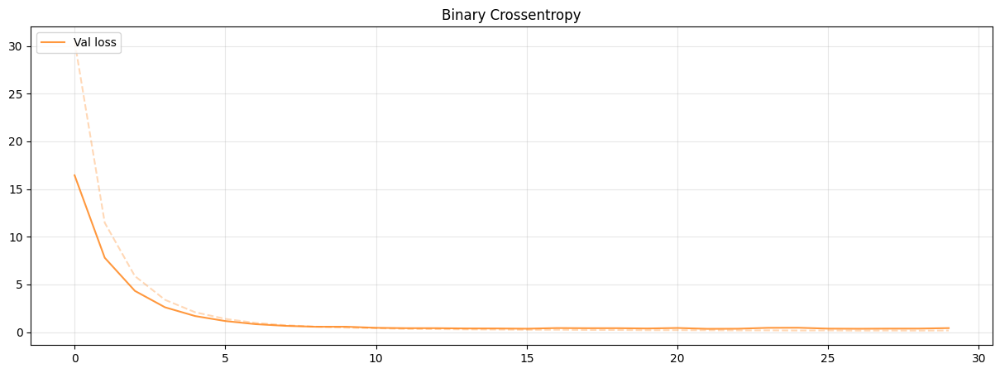
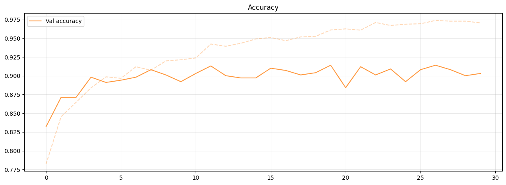

# AN2DL 2023 Challenge 1 - Dip Learners

## Project Overview

This project applies neural networks to recognize plant diseases through image classification. The task involves binary classification to distinguish between healthy and diseased plants. We leveraged transfer learning with pre-trained models to improve the accuracy of our predictions. You can follow our thinking process in the [notebooks folder](./notebooks).

## Introduction

This project addresses plant disease recognition using transfer learning. We experimented with various neural network architectures, including VGG16, ResNet50, and ConvNextBase. The **ConvNextBase architecture** achieved the best performance with the following metrics on the test set (which was never provided to us):
- **Accuracy**: 87.10%
- **Precision**: 82.77%
- **Recall**: 83.42%
- **F1-Score**: 83.09%

## Dataset

The dataset consists of 5,200 RGB images (96x96 pixels) of both healthy and diseased plants:
- **Healthy plants**: 3,199 (62%)
- **Diseased plants**: 2,001 (38%)

After removing outliers, the dataset was reduced to 5,004 images. Class weights were calculated using scikit-learn to address dataset imbalance.

## Model Architecture

Our final model is based on the **ConvNextBase architecture**, pre-trained on ImageNet. We froze the first 277 layers and fine-tuned the remaining layers to adapt the model to our specific task. Additional dense layers were added, incorporating techniques like dropout and batch normalization to prevent overfitting.

### Key Features:
- **Leaky ReLU activation** for faster convergence
- **Dropout** and **Batch Normalization** to enhance generalization
- **Ridge regularization** to manage model complexity

## Hyperparameter Tuning

We employed several techniques to optimize model performance:
- **Early stopping** and **learning rate scheduling** to prevent overfitting
- **Seed setting** for reproducibility
- **Data augmentation** (zoom, rotation, contrast, vertical flip) to improve generalization

## Results

The final model was evaluated on the test set with the following metrics:
- **Accuracy**: 87.10%
- **Precision**: 82.77%
- **Recall**: 83.42%
- **F1-Score**: 83.09%

Here's the comparison of the validation loss and accuracy during training, illustrating the model's convergence and stability over time.



## How to Run

1. Clone the repository:
   ```batch
   git clone https://github.com/LucaBrembilla/AN2DL2023Challenge1Polimi
   ```
   
2. Install dependencies:
   ```batch
   pip install -r requirements.txt
   ```
   
3. Download and place the data in `data/public_data.npz`. You can find it [here](https://drive.google.com/file/d/1pJo2-7Mdu74xS_uIfRj5GXVSSZrsYyvC/view?usp=drive_link).
   
4. Download our [our pretrained model](https://drive.google.com/file/d/1-43LO0PdPByljEOuDBGvbhpqhH-G2MvG/view?usp=sharing) and place it in `models/AN2DL2023Challenge1Polimi.keras`, or train your own model by running the train script:
   ```batch
   python train.py
   ```

5. Run the test script:
   ```batch
   python test.py
   ```

## Team Members
- Luca Brembilla (me)
- Matteo Miano
- Linda Frickleton
- Marianna Dragonetti

## License

This project is licensed under the MIT License. See the [LICENSE](./LICENSE) file for details.
